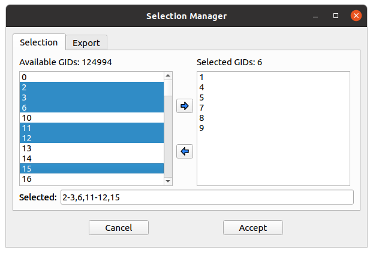

======================
SimPart User Interface
======================

---------------------------
SimPart Application Toolbar
---------------------------

The application bar presents several icons to perform actions such as opening datasets, showing or hiding panels and configuring the colors of the visualization (:numref:`figA`). 

.. _figA:

.. figure:: images/VSImage001.png
   :alt: ViSimpl application toolbar
   :align: center

   ViSimpl application tool bar. 

For more information click on application menu "File" and "Options" to relate icons to specific commands.

^^^^
File
^^^^

- **Open BlueConfig**: Load the circuit from the given BlueConfig file with the specified target.
- **Open CSV**: Loads a dataset stored in a CSV file. 
- **Open HDF5 network and activity**: Loads a dataset in HDF5 format. The application will ask for the network file first and then for the activity file.
- **Open Subset/Events file**: Loads a subset or events file of the dataset currently in memory.
- **Close dataset**: This option closes the current dataset in memory. This option is *currently disabled*. For loading a new dataset close the application and reopen. 

^^^^^^^
Options
^^^^^^^

- **Home**: Reset view perspective to original values of focus and camera distance. 
- **Background Color**: Displays a dialog where background color of the visualization window can be selected. 
- **Toggle Playback Dock**: This will show or hide the playback dock.

.. _figAA:

   Simulation playback dock.

- **Toggle Simulation Config Dock**: This button will show the simulation configuration dock when activated. 
- **Show current simulation time**: This option shows or hides the current simulation time in the visualization window.
- **Show events activity**: This option shows or hides the visualization of events in the visualization window. When an event ocurrs a label with the event color and name will be shown.
- **Update on idle**: This will reduce visualization repaint calls to user interaction (camera rotation, etc.) and specific actions. 
- **Show FPS on idle update**: Displays a label with current frames per second rate. Note: this might reduce performance due to interface update calls, so it is recommended to hide it when not interested on measuring performance. 

^^^^^^^^^^^^^^^^^^^^^^
Playback control panel
^^^^^^^^^^^^^^^^^^^^^^

The playback menu provides different actions to manage visualization flow. As shown in the image above, the playback control panel shows:

- A **summary** widget with the **activity of the current selection**. User also might jump to the desired part of the simulation by clicking on the summary. 
- A slider for performing arbitrary jumps to the desired parts of the simulation as for the summary widget, with the current time of playback of the left and the total one on the right side. 
- Playback control buttons provide the typical video playback control such as "Play/Pause", "Stop", "Play at", etc. It also allows the user to perform "Step by step" functionality through the "Next" and "Previous" buttons. The "Repeat" button will activate the loop playback, so simulation visualization will restart from the beginning when finished. 

^^^^^^^^^^^^^^^^^^^^^^^^^^^
Visualization control panel
^^^^^^^^^^^^^^^^^^^^^^^^^^^

The visualization control panel provides the controls for configuring the parameters of the visualization process. Through these controls user can adjust (:numref:`figB`):

- The color and size transfer function that will be used for representing the activity of each entity.
- **Simulation timestep**: This is the step (in time units) that will be taken everytime the application plays. 
- **Timesteps per second**: The number of timesteps (with the defined size) that will be taken on every second. 
- **Step playback duration(s)**: This is the duration (in real time) used for the "Step by step" feature. For example: a duration of 5 will reproduce the next step (of the defined "Simulation timestep") interpolating intermediate steps along 5 seconds.

.. _figB:

 
   Visualization control panel.
   
- **Scale factor**: This options changes the scale of the visualization window showing the dataset. 
- **Shader configuration**: This option changes the particle visualization. The options are **default** (alpha blending) and **solid**. 
- **Decay function**: This is the duration of activation of entities. Decay will determine the time taken to transit color and size transfer functions (from left to right) for each entity from the activation time to a rest state. It has to be configured considering "Simulation timestep" size and "Timesteps per second". 
- **Alpha blending function**: This option provides two transparency modes for representing the activity. **Normal mode** will compose transparency following the typical "Back to front" render in order to preserve coherent results in terms of position, depth and color, and should be used when user wants to perceive depth and unaltered colors. **Accumulative mode** will add up all the entities on the back of each pixel, mixing all the colors and eventually saturating to white when too much complexity is shown. This last mode can be used in order to perceive a global understanding of what is being activated independently of the depth.

^^^^^^^^^^^^^^^^^^^^^^^^^^^^^^^^^^^^^^
Transfer function configuration dialog
^^^^^^^^^^^^^^^^^^^^^^^^^^^^^^^^^^^^^^

When the gradient widget is clicked, a dialog will appear with controls to configure the desired transfer function (:numref:`figC`).

This widget shows several gradient widgets, a list of color presets and the size range configuration widgets. The final transfer function composed of the typical four color channels: **Red, Green, Blue and Alpha components**, and also the particle **Size**.

.. _figC:

   Transfer functions configuration dialog.

These channels can be configured through the point stops to establish the transition between different activation times of the entities. **Left click** at the desired position point will **create a stop** at the same X and Y on the Red, Green, Blue and Alpha 
gradients. Moving through the X axis will move all related points horizontally. **Right click** on a point will **remove the stop** from all channels.

Transfer function colors and size evolve through time following the transition from **left to right** on each gradient. This way user might create a greenish result by placing the Red and Blue color stops at the bottom and the Green one on a higher position (vertically). Size function is configured the same way, but considering that both "Min size" and "Max size" widgets' values correspond to the minimum and maximum sizes of particles. 

The resulting transfer function can be seen in both "Result (pure)" and "Result (alpha)", being the linear (RGB) interpolation of the colors without Alpha component in the first and with Alpha in the second. 

The present color and size transfer functions can be previewed or applied on the scene by pressing the "Preview" or "Save" buttons respectively. To discard changes press "Discard".

^^^^^^^^^^^^^^^
Clipping planes
^^^^^^^^^^^^^^^

There is a feature for activating a couple of clipping planes that will reduce the visualized particles to the ones contained between both planes. This option can be activated in the **Selection** submenu, by checking the option **"Clipping"**. Then the planes will appear surrounding the whole set of elements (:numref:`figD`).

.. _figD:

   Clipping a visualization with planes.

Planes can be fully configured by setting the distance between them, their height and width, the color. Planes can also be hidden by unchecking the option **"Show planes"**.  In addition, planes can be rotated and translated by holding the "Shift" key 
and pressing left and right mouse click respectively.

The contained elements between both planes can stored as the current selection by clicking the button "To Selection". 

^^^^^^^^^^^^^^^^^^^^
Selection management
^^^^^^^^^^^^^^^^^^^^

In the "Selection" tab it can be found a button [...] to open the selection management widget (:numref:`figE`). This widget allows to choose which elements are included as part of the selection as well as saving the current selection in a text (.txt) file.

.. _figE:

   Selection management dialog.

Elements can be added or removed from the selection list by clicking on the buttons indicating the respective direction (<-- and -->). Both lists accept advanced selection mode i.e. managing selection through Ctrl and Shift keys for range and addition/subtraction selecting. Once the selection has the desired elements it can be saved to a file on the "Export" tab and use it as the current selection by clicking on "Accept".  

When creating a selection the application will ask for a group name. The name can be later edited, if needed, in the selection groups tab by clicking in the group name. The created selection will appear with the name and size in the selection tab with a default color. There, clicking in the associated gradient widget, the selection color can be modified the same way as before with the transfer function edition dialog (:numref:`figF1`).

.. _figF1:

.. figure:: images/VSImage013.png
   :alt: Selection groups list with default assigned colors for each of the three selected groups.
   :align: center
   :width: 1850
   :scale: 35%

   Selection groups list with default assigned colors for each of the three selected groups.
   
In the "Export" tab there are several widgets to customize the file exporting of the current selection (:numref:`figF`). The user can set a prefix and suffix for the exported GIDs in the respective text boxes as well as establishing the separator between them. For custom separator check the "Other" option, using the one provided in the text box. The path where the file will be stored can be directly written or browsed. For saving the selection to file click on the "Save" button. 

.. _figF:

.. figure:: images/VSImage007.png
   :alt: Selection export.
   :align: center
   :width: 648
   :scale: 55%

   Selection export dialog.

Groups can be saved to disk with its properties (gids, active status and color transfer functions) using the **"Save"** button located in the **Groups** tab. Groups can be loaded from disk using the **"Load"** button (:numref:`figF2`).

.. _figF2:

   Groups saving and loading buttons.

------------------
Keys and shortcuts
------------------

The following actions can be performed by clicking the button, selecting the option at menu bar and pressing the corresponding key combination:

- **Ctrl + B**: Change background color 
- **Ctrl + Shift + B**: Open BlueConfig file. 
- **Ctrl + T**: Show/Hide "Simulation configuration" menu. 
- **Ctrl + P**: Show/Hide "Playback control" menu. 
- **Ctrl + Q**: Close application.
