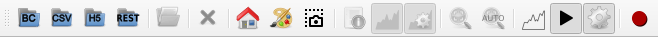
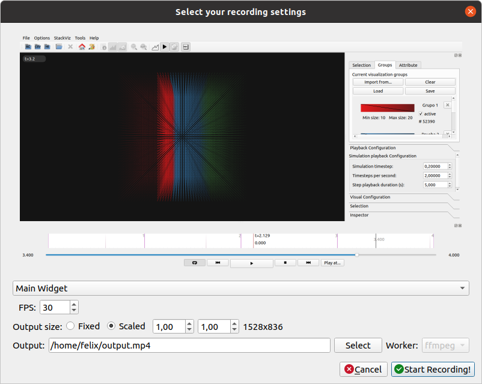

======================
SimPart User Interface
======================

---------------------------
SimPart Application Toolbar
---------------------------

The application bar presents several icons to perform actions such as opening datasets, showing or hiding panels and configuring the colors of the visualization (:numref:`figA`). 

.. _figA:

   SimPart application tool bar. 

For more information click on application menu "File", "Options" and "StackViz" to relate icons to specific commands.

^^^^^^^^^
File menu
^^^^^^^^^

- **Open BlueConfig**: Load the circuit from the given BlueConfig file with the specified target.
- **Open CSV**: Loads a dataset stored in a CSV file. 
- **Open HDF5 network and activity**: Loads a dataset in HDF5 format. The application will ask for the network file first and then for the activity file.
- **Connect to REST server...**: Opens the REST connection dialog to connect and get data from a NEST source via Insite protocol (:numref:`figCB`).

.. _figCB:

   REST connection dialog.

- **Open Subset/Events file**: Loads a subset or events file of the dataset currently in memory.
- **Load camera positions**: Loads a JSON file with the description of camera positions. 
- **Save camera positions**: Saves the currently stored camera positions to a JSON file. 
- **Close Dataset**: This option closes the current dataset in memory, resetting the application interface. If the current dataset is a REST connection then a close dataset dialog will be shown, letting the user choose between resetting the spikes data (and reloading again from the same connection) or fully closing the dataset (:numref:`figCAA`).

.. _figCAA:

   Close dataset dialog when closing a REST dataset.

^^^^^^^^^^^^
Options menu
^^^^^^^^^^^^

- **Home**: Reset view perspective to original values of focus and camera distance. 
- **Add camera position**: Adds the current camera position to the list of positions with a name given by the user (:numref:`figAB`).

.. _figAB:

.. figure:: images/VSImage018.png
   :alt: Camera position name dialog.
   :align: center
   :width: 220
   :scale: 100%

   Camera position name dialog.

- **Remove camera position**: Lets the user remove a camera position from the list of positions.
- **Camera positions**: Lists the currently stored camera positions in a submenu. Clicking on a camera position will move the camera to the position.

.. note::

   Camera positions are independent of the data and the scale applied to the data coordinates.

- **Background Color**: Displays a dialog where background color of the visualization window can be selected. 
- **Toggle Playback Dock**: This will show or hide the playback dock (:numref:`figAA`).

.. _figAA:

.. figure:: images/VSImage002.png
   :alt: Playback dock
   :align: center
   :width: 1277
   :scale: 75%

   Simulation playback dock.

- **Toggle Simulation Config Dock**: This button will show the simulation configuration dock when activated.
- **Toggle StackViz Dock**: This button will show the StackViz dock when activated.
- **Show current simulation time**: This option shows or hides the current simulation time in the visualization window.
- **Show events activity**: This option shows or hides the visualization of events in the visualization window. When an event ocurrs a label with the event color and name will be shown.
- **Add ZeroEQ selections as visual groups**: By default the ids received by the ZeroEQ channel will be interpreted by SimPart as a tentative selection, if this option is checked then the received ids will be added automatically as a visual group.
- **Update on idle**: This will reduce visualization repaint calls to user interaction (camera rotation, etc.) and specific actions. 
- **Show FPS on idle update**: Displays a label with current frames per second rate. Note: this might reduce performance due to interface update calls, so it is recommended to hide it when not interested on measuring performance. 
- **Configure REST connection...**: Shows the REST configuration dialog where the frequency of the requests and the spikes size (:numref:`figCA`).

.. _figCA:

   REST connection configuration dialog.

^^^^^^^^^^^^^
StackViz menu
^^^^^^^^^^^^^

This menu contains options for the StackViz widget included in SimPart. It will only be enabled if the StackViz dock is visible.

- **Auto Naming Selections**: The histograms created in StackViz will be named automatically if this option is enabled.
- **Fill plots**: The histograms and focus widget in StackViz will be filled graphs if this options is enabled. If disabled only the histogram line will be shown.
- **Show Data Manager**: Shows/hides the StackViz data manager that shows information about the histograms.
- **Focus on playhead**: If this button is clicked the StackViz focus widget will be centered in the part of the selected histogram that is currently being visualized. 
- **Follow playhead**: If this option is enabled the StackViz focus widget will always be centered in the part of the selected histogram that is being visualized.
- **Show StackViz Panels**: Shows/hides the StackViz configuration panels. Hiding the panels will make the focus widget larger.

^^^^^^^^^^
Tools menu
^^^^^^^^^^

This menu contains the recorder tools and its configuration options. 

- **Recorder**: This button shows the recorder configuration dialog if the recorder is not running. If the recorder is running it will stop the recorder.
- **Advanced recorder options**: This option will enable advanced configuration options in the recorder configuration dialog. 

^^^^^^^^^
Help menu
^^^^^^^^^

- **About**: Shows the about dialog with information about SimPart application.

^^^^^^^^^^^^^^^^^^^^^^
Playback control panel
^^^^^^^^^^^^^^^^^^^^^^

The playback menu provides different actions to manage visualization flow. As shown in the image above, the playback control panel shows:

- A **summary** widget with the **activity of the current selection**. User also might jump to the desired part of the simulation by clicking on the summary. 
- A slider for performing arbitrary jumps to the desired parts of the simulation as for the summary widget, with the current time of playback of the left and the total one on the right side. 
- Playback control buttons provide the typical video playback control such as "Play/Pause", "Stop", "Play at", etc. It also allows the user to perform "Step by step" functionality through the "Next" and "Previous" buttons. The "Repeat" button will activate the loop playback, so simulation visualization will restart from the beginning when finished. 

^^^^^^^^^^^^^^^^^^^^^^^^^^^
Visualization control panel
^^^^^^^^^^^^^^^^^^^^^^^^^^^

The visualization control panel provides the controls for configuring the parameters of the visualization process. Through these controls user can adjust (:numref:`figB`):

* **Color And Size Transfer Function**

  * The color and size transfer function that will be used for representing the activity of each entity. Clicking on the color widget will open the *Color Transfer Function* dialog for the group or general color transfer.

* **Playback configuration**

  * **Simulation timestep**: This is the step (in time units) that will be taken everytime the application plays. 
  * **Timesteps per second**: The number of timesteps (with the defined size) that will be taken on every second. 
  * **Step playback duration(s)**: This is the duration (in real time) used for the "Step by step" feature. For example: a duration of 5 will reproduce the next step (of the defined "Simulation timestep") interpolating intermediate steps along 5 seconds.

.. _figB:

.. figure:: images/VSImage003.png
   :alt: All tabs of the Visualization control panel.
   :align: center
   :width: 1600
   :scale: 40%
 
   All tabs in the Visualization control panel.

* **Visual configuration**

  * **Scale factor**: This options scales the data coordinates by multiplying them with the specified factor. 

  * **Shader configuration**: This option changes the particle visualization. The options are **default** (alpha blending) and **solid**. 

  * **Decay function**: This is the duration of activation of entities. Decay will determine the time taken to transit color and size transfer functions (from left to right) for each entity from the activation time to a rest state. It has to be configured considering "Simulation timestep" size and "Timesteps per second". 

  * **Alpha blending function**: This option provides two transparency modes for representing the activity. **Normal mode** will compose transparency following the typical "Back to front" render in order to preserve coherent results in terms of position, depth and color, and should be used when user wants to perceive depth and unaltered colors. **Accumulative mode** will add up all the entities on the back of each pixel, mixing all the colors and eventually saturating to white when too much complexity is shown. This last mode can be used in order to perceive a global understanding of what is being activated independently of the depth.

* **Selection**

  * **Current selection**: Clicking the three dots button will open the group selection by id dialog. Once the group has been defined the user can create a group by clicking the *Add Group* or discard the selection using the *Discard* button. A more detailed description is available in the **Selection** section of this documentation.

  * **Clipping planes**: Checking the checkbox will show the clipping planes in the 3d view. The position and characteristics of the clipping planes can be modified with the boxes in this section. A more detailed description is available in the **Clipping planes** section of this documentation.

* **Inspector**

  * **Object inspector**: This section show information about the loaded dataset (network size and number of spikes) and selected ids (using ZeroEQ network selection).

^^^^^^^^^^^^^^^^^^^^^^^^^^^^^^^^^^^^^^
Transfer function configuration dialog
^^^^^^^^^^^^^^^^^^^^^^^^^^^^^^^^^^^^^^

When the gradient widget is clicked, a dialog will appear with controls to configure the desired transfer function (:numref:`figC`).

This widget shows several gradient widgets, a list of color presets and the size range configuration widgets. The final transfer function composed of the typical four color channels: **Red, Green, Blue and Alpha components**, and also the particle **Size**.

.. _figC:

.. figure:: images/VSImage004.png
   :alt: Transfer functions configuration dialog
   :align: center
   :width: 800
   :scale: 60%

   Transfer functions configuration dialog.

These channels can be configured through the point stops to establish the transition between different activation times of the entities. **Left click** at the desired position point will **create a stop** at the same X and Y on the Red, Green, Blue and Alpha 
gradients. Moving through the X axis will move all related points horizontally. **Right click** on a point will **remove the stop** from all channels.

Transfer function colors and size evolve through time following the transition from **left to right** on each gradient. This way user might create a greenish result by placing the Red and Blue color stops at the bottom and the Green one on a higher position (vertically). Size function is configured the same way, but considering that both "Min size" and "Max size" widgets' values correspond to the minimum and maximum sizes of particles. 

The resulting transfer function can be seen in both "Result (pure)" and "Result (alpha)", being the linear (RGB) interpolation of the colors without Alpha component in the first and with Alpha in the second. 

The present color and size transfer functions can be previewed or applied on the scene by pressing the "Preview" or "Save" buttons respectively. To discard changes press "Discard".

^^^^^^^^^^^^^^^
Clipping planes
^^^^^^^^^^^^^^^

There is a feature for activating a couple of clipping planes that will reduce the visualized particles to the ones contained between both planes. This option can be activated in the **Selection** submenu, by checking the option **"Clipping"**. Then the planes will appear surrounding the whole set of elements (:numref:`figD`).

.. _figD:

.. figure:: images/VSImage005.png
   :alt: Clipping planes.
   :align: center
   :width: 1280
   :scale: 40%

   Clipping a visualization with planes.

Planes can be fully configured by setting the distance between them, their height and width, the color. Planes can also be hidden by unchecking the option **"Show planes"**.  In addition, planes can be rotated and translated by holding the "Shift" key 
and pressing left and right mouse click respectively.

The contained elements between both planes can stored as the current selection by clicking the button "To Selection". 

.. _groups-reference-label:

^^^^^^^^^^^^^^^^^^^^
Selection management
^^^^^^^^^^^^^^^^^^^^

In the "Selection" tab it can be found a button [...] to open the selection management widget (:numref:`figE`). This widget allows to choose which elements are included as part of the selection as well as saving the current selection in a text (.txt) file.

.. _figE:

.. figure:: images/VSImage006.png
   :alt: Selection management.
   :align: center
   :width: 622
   :scale: 60%

   Selection management dialog.

Elements can be added or removed from the selection list by clicking on the buttons indicating the respective direction (right to include and left to exclude from the selection). Both lists accept advanced selection mode i.e. managing selection through Ctrl and Shift keys for range and addition/subtraction selecting. Once the selection has the desired elements it can be saved to a file on the "Export" tab and use it as the current selection by clicking on "Accept".  

In the **Selection** tab the text field at the bottom of the dialog shows the currently selected values or ranges of values in the available list. The user can enter the ranges in that field manually by separating them by commas. 

When creating a selection the application will ask for a group name. The name can be later edited, if needed, in the selection groups tab by clicking in the group name. The created selection will appear with the name and size in the selection tab with a default color. There, clicking in the associated gradient widget, the selection color can be modified the same way as before with the transfer function edition dialog (:numref:`figF1`).

.. _figF1:

.. figure:: images/VSImage013.png
   :alt: Selection groups list with default assigned colors for each of the three selected groups.
   :align: center
   :width: 1530
   :scale: 40%

   Selection groups list with default assigned colors for each of the three selected groups.
   
In the "Export" tab there are several widgets to customize the file exporting of the current selection (:numref:`figF`). The user can set a prefix and suffix for the exported GIDs in the respective text boxes as well as establishing the separator between them. For custom separator check the "Other" option, using the one provided in the text box. The path where the file will be stored can be directly written or browsed. For saving the selection to file click on the "Save" button. 

.. _figF:

   Selection export dialog.

Groups can be saved to disk with its properties (gids, active status and color transfer functions) using the **"Save"** button located in the **Groups** tab. Groups can be loaded from disk using the **"Load"** button (:numref:`figF2`).

.. _figF2:

.. figure:: images/VSImage014.png
   :alt: Groups saving and loading.
   :align: center
   :width: 400
   :scale: 55%

   Groups saving and loading buttons.

.. _recorder-reference-label:

^^^^^^^^
Recorder
^^^^^^^^

The recording feature can be activated using the Options menu or by clicking the Recorder icon in the toolbar. The user will be presented with the recorder configuration dialog (:numref:`figG0`).

.. _figG0:

   Recorder configuration dialog.

The recorder will generate a mp4 video if the media application **ffmpeg** is detected and available, if not the generated output will be individual frames. The **frames per second** of the output can be specified here. The user can choose explicilty which worker (video or frames) to use to generate the output in the advanced configuration dialog (:numref:`figG1`) (enabled using the **Advanced recorder options checkbox** in the Options menu).

.. _figG1:

.. figure:: images/VSImage016.png
   :alt: Recorder advanced configuration dialog.
   :align: center
   :width: 802
   :scale: 50%

   Recoder advanced configuration dialog.

Using the **advanced configuration dialog** an area of the application can be selected for recording or an individual widget.

If the output is a video the user can specify the location of the generated file using the **Select** button. If the output is a sequence of frames the user can specify the destination directory using the Select button in the dialog.

The dimensions of the output are shown and can be modified with the scale options.

While the recorder is working the associated toolbar button will remain down and the icon will change every second with an image of a "Stop" button with REC letters written inside it. The user must click it again to stop the recording. The recorder can also be stopped using the **Recorder** button in the **Tools** menu or the keyboard shortcut **Ctrl + R**.

.. note::
   If the output is a video the filename of the output file will end with "_temporal" while recording. Once the recording has finished it will change to the selected output name in the configuration dialog. The application will warn if the user tries to exit the application while a recording is being made.

.. warning::
   To record a video the system must have **ffmpeg** installed, preferably with Nvidia hardware acceleration. 
   If ffmpeg is not available in the system only the **images** worker will be available in the recorder.

^^^^^^^^^^^^^
StackViz dock
^^^^^^^^^^^^^

The StackViz dock widget (:numref:`figG2`) presents the same functionality available in the standalone application. All the visual groups will have its histogram shown in StackViz.

.. _figG2:

   StackViz dock widget.

In the bottom-right corner of the widget are the configuration options:

- **Normalization**: Options to normalize the values of the histograms.
- **Scale adjustement**: Options to adjust the horizontal and vertical scale of the histograms. 
- **Bin configuration**: Number of bins to group values and histogram zoom factor. 
- **Data inspector**: Shows the value of the current visualization point in the timeline.
- **Rule configuration**: Lets the user set the number of divisions in the histogram timeline.

Selecting one of the histograms will show its values in the histogram focus widget and send the ids of the selected group via ZeroEQ.

-------
3D View
-------

The 3D view that shows the dataset can be manipulated using the mouse with some keyboard modifiers. The user can:

- **Rotate the view** by holding down the left mouse button and dragging the mouse.
- **Translate the view** by holding down the *Control* key and the left mouse button and dragging the mouse.
- **Zoom the view**: Using the mouse wheel.

The same movements apply to the clipping planes only if the user also holds down the *Shift* key.

--------------------------
SimPart Keys and shortcuts
--------------------------

The following actions can be performed by clicking the button, selecting the option at menu bar and pressing the corresponding key combination:

- **Ctrl + B**: Change background color 
- **Ctrl + Shift + B**: Open BlueConfig file. 
- **Ctrl + T**: Show/Hide "Simulation configuration" menu. 
- **Ctrl + P**: Show/Hide "Playback control" menu. 
- **Ctrl + Q**: Close application.
- **Ctrl + R**: Toggle recorder.

