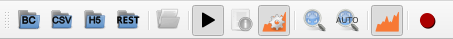

=======================
StackViz User Interface
=======================

----------------------------
StackViz Application Toolbar
----------------------------

The application bar presents several icons to perform actions such as opening datasets, centering the playback focus and changing the data visualization options. 

   StackViz application tool bar.

For more information click on application menu "File", "Playback" and "Options" to relate icons to specific commands.

^^^^
File
^^^^

- **Open BlueConfig**: Load the circuit from the given BlueConfig file with the specified target.
- **Open CSV**: Loads a dataset stored in a CSV file. 
- **Open HDF5 network and activity**: Loads a dataset in HDF5 format. The application will ask for the network file first and then for the activity file.
- **Open Subset/Events file**: Loads a subset or events file of the dataset currently in memory.

^^^^^^^^
Playback
^^^^^^^^

- **Focus on playhead**: Sets the focus area on the current time point. 
- **Follow playhead**: If this option is enabled the focus area will translate its position to the current time point as is being played. 

^^^^^^^
Options
^^^^^^^

- **Toggle Playback Dock**: This will show or hide the playback dock.
- **Auto naming selections**: If this option is enabled a default name will be assigned to each selection. 
- **Fill plots**: If this option is enabled the plots will be filled with the color assigned to it. If not only the points of the graph will be shown with the color assigned.
- **Show Configuration Panels**: Shows/Hides the configuration panels. Hiding the panels will make the focus widget wider. 
- **Add ZeroEQ selections as histograms**: Enable this option to visualize ZeroEQ received ids as histograms.

^^^^^^^^^^^^^^^^^^^^
Configuration panels
^^^^^^^^^^^^^^^^^^^^

Several panels located in the bottom-right area of StackViz allows the user to configure several visualization options:

- **Normalization**: Options to configure the histograms data normalization.
- **Scale adjustment**: Options to configure the vertical and horizontal scale of the histograms.
- **Bins configuration**: Options to set the number of groups of the values and its zoom factor.
- **Data inspector**: Shows the value of the data currently being visualized and the local and global maximum values.
- **Rule configuration**: Lets the user define the number of horizontal divisions of the histograms.

^^^^^^^^^^^^^^^^^^^^^^
Histogram focus widget
^^^^^^^^^^^^^^^^^^^^^^

The histogram focus provides an insight into the data selected or currently being played. 

.. figure:: images/VSImage011.png
   :alt: Histogram focus
   :align: center
   :width: 643 px
   :scale: 60%

   Histogram focus.
   
^^^^^^^^^^^^^^^^^^^   
Data manager widget
^^^^^^^^^^^^^^^^^^^

The data manager widget shows the subsets and events. The upper widget shows the events and allows the user to toggle the visibility or delete them. The lower widget shows the subsets and the number of elements in each of one, allowing the user to toggle the visualization or delete them.

.. figure:: images/VSImage012.png
   :alt: Data manager widget. 
   :align: center
   :width: 516 px
   :scale: 60%

   Data manager widget.

---------------------------
StackViz Keys and shortcuts
---------------------------

The following actions can be performed by clicking the button, selecting the option at menu bar and pressing the corresponding key combination:

- **Ctrl + Shift + B**: Open BlueConfig file. 
- **Ctrl + P**: Show/Hide "Playback control" menu. 
- **Ctrl + A**: Toggle enable/disable auto-naming sections.
- **Ctrl + Q**: Close application.

