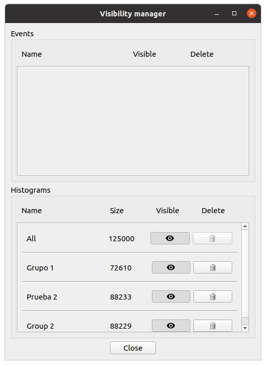

=======================
StackViz User Interface
=======================

----------------------------
StackViz Application Toolbar
----------------------------

The application bar presents several icons to perform actions such as opening datasets, centering the playback focus and changing the data visualization options. 

.. figure:: images/VSImage008.png
   :alt: StackViz application toolbar
   :align: center

   StackViz application tool bar.

For more information click on application menu "File", "Playback" and "Options" to relate icons to specific commands.

^^^^
File
^^^^

- **Open BlueConfig**: Load the circuit from the given BlueConfig file with the specified target.
- **Open CSV**: Loads a dataset stored in a CSV file. 
- **Open HDF5 network and activity**: Loads a dataset in HDF5 format. The application will ask for the network file first and then for the activity file.
- **Open Subset/Events file**: Loads a subset or events file of the dataset currently in memory.

^^^^^^^^
Playback
^^^^^^^^

- **Focus on playhead**: Sets the focus area on the current time point. 
- **Follow playhead**: If this option is enabled the focus area will translate its position to the current time point as is being played. 

^^^^^^^
Options
^^^^^^^

- **Toggle Playback Dock**: This will show or hide the playback dock.
- **Auto naming selections**: If this option is enabled a default name will be assigned to each selection. 
- **Fill plots**: If this option is enabled the plots will be filled with the color assigned to it. If not only the points of the graph will be shown with the color assigned.

^^^^^^^^^^^
Scale panel
^^^^^^^^^^^

The scale panel provides scale and visualization options for the graphs. The normalization of each group can be selected between **linear** and **logarithmic** display. Both the vertical and horizontal scale of the graphs can be specified in this panel. 

.. figure:: images/VSImage009.png
   :alt: Scale panel
   :align: center
   :width: 296
   :scale: 80%

   Scale panel.

^^^^^^^^^^
Data panel
^^^^^^^^^^

The data panel shows the value of the currently selected time point and the maximum value for the local and global areas. 

This panel allows the user to configure the number of stops in the "visualization time ruler" to N, providing a visualization of the timeline in N intervals. 

.. figure:: images/VSImage010.png
   :alt: Data panel
   :align: center
   :width: 262
   :scale: 80%

   Data panel.

^^^^^^^^^^^^^^^^^^^^^^
Histogram focus widget
^^^^^^^^^^^^^^^^^^^^^^

The histogram focus provides an insight into the data selected or currently being played. 

   Histogram focus.
   
^^^^^^^^^^^^^^^^^^^   
Data manager widget
^^^^^^^^^^^^^^^^^^^

The data manager widget shows the subsets and events. The upper widget shows the events and allows the user to toggle the visibility or delete them. The lower widget shows the subsets and the number of elements in each of one, allowing the user to toggle the visualization or delete them.

   Data manager widget.

------------------
Keys and shortcuts
------------------

The following actions can be performed by clicking the button, selecting the option at menu bar and pressing the corresponding key combination:

- **Ctrl + Shift + B**: Open BlueConfig file. 
- **Ctrl + P**: Show/Hide "Playback control" menu. 
- **Ctrl + A**: Toggle enable/disable auto-naming sections.
- **Ctrl + Q**: Close application.

