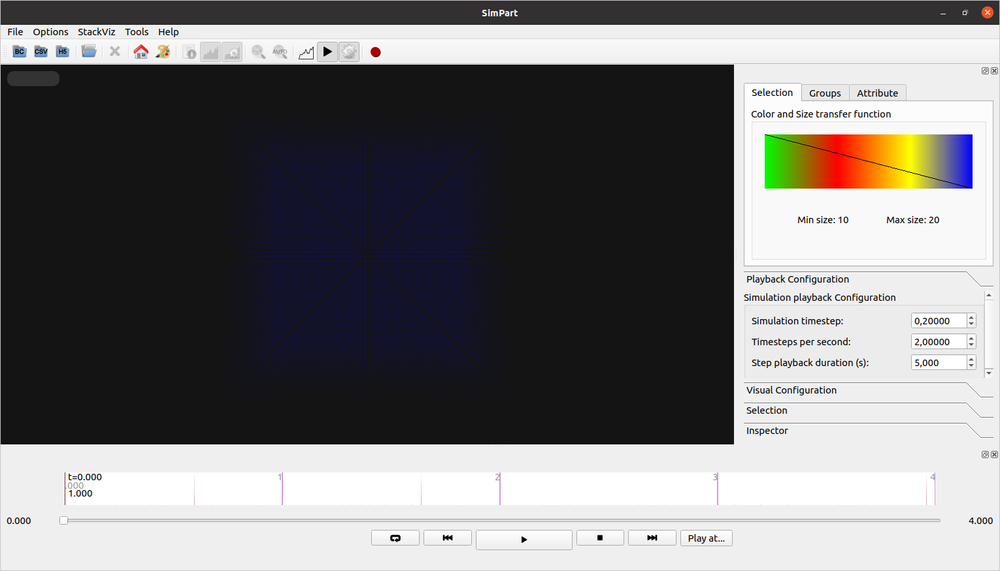
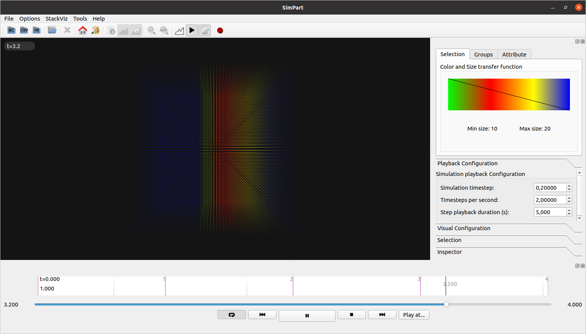
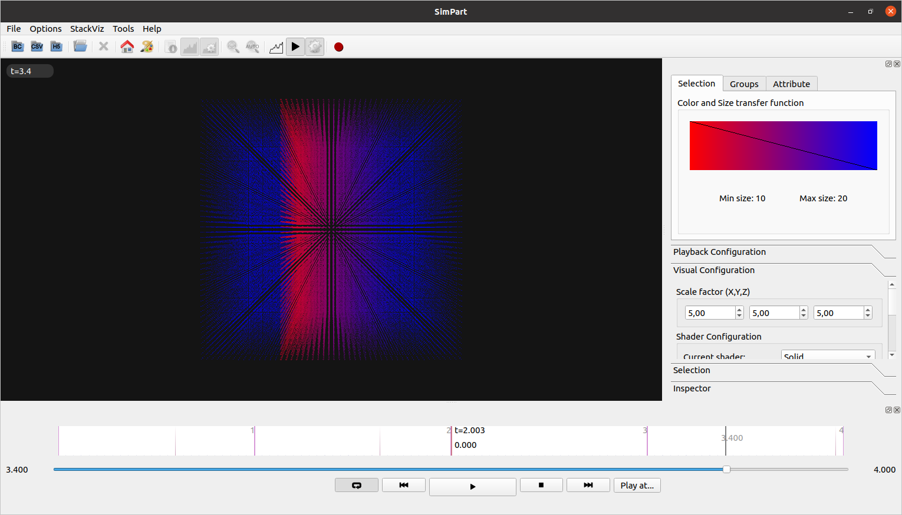
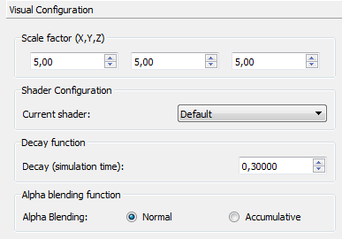
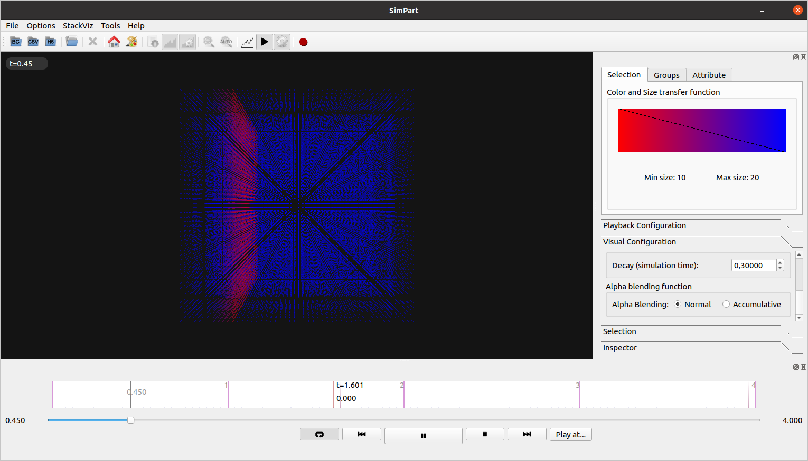
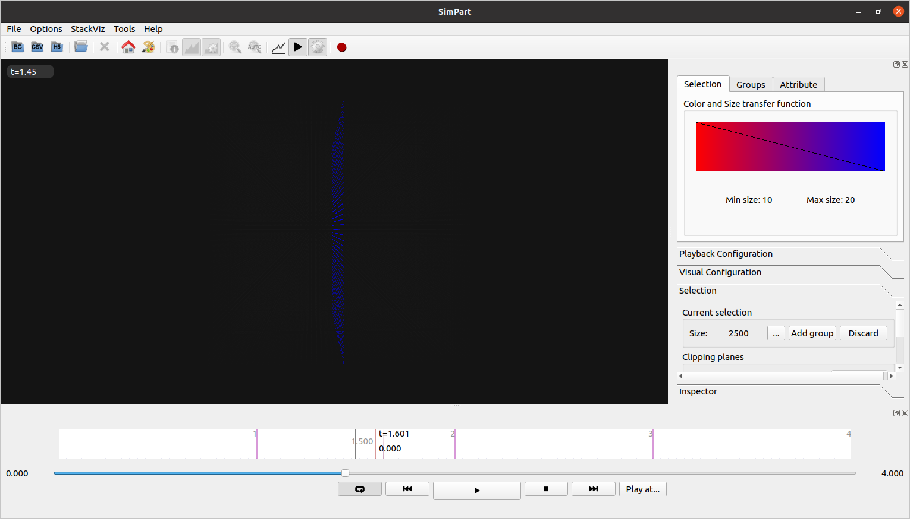
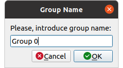
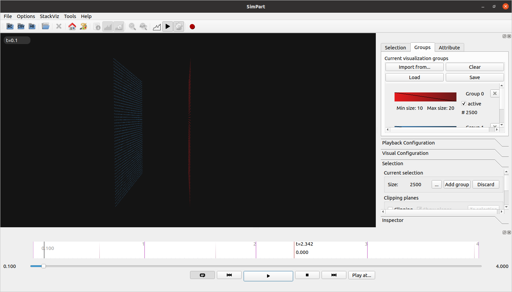
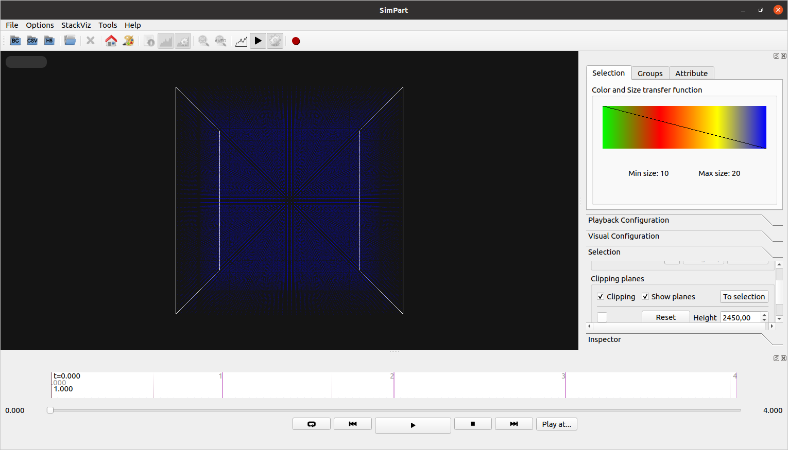
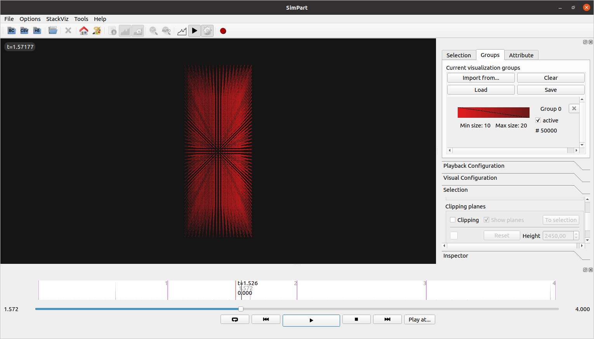

=======
Runbook
=======

.. note::
   This runbook will test the main functionalities of both SimPart and StackViz and can be considered as a basic tutorial for both applications, but **not** as a complete and exhaustive tutorial of all the functionalities. 

.. note::
   Some screenshots may be from previous ViSimpl versions. The functionalities in the runbook cover up to version 1.8.0.

After loading the test file the 3D view in SimPart will show the particles in a cube-like structure centered on the view (:numref:`fig1`).

.. _fig1:

   SimPart application starting with test data files. 
   
-------
Playing   
-------

Click on the '**repeat**' button to activate playing in a loop, then click on the '**play**' button. The particles will change color according to the default color range, from gree to blue (:numref:`fig2`).

.. _fig2:

   Particles change color when activated by a spike. 

------------------------
Color Transfer functions
------------------------
   
Click on the color widget, the '**Color transfer functions**' dialog will appear. Select the '**red-blue [ multi-hue]**' option in the dropbox and then click the '**preview**' button in the dialog to change the color in the main 3D view. Then click on the '**save**' button to close the dialog (:numref:`fig3`). 

.. _fig3:

   Color transfer functions dialog. 
   
The 3D view should show the particles being activated with the red colour and changing its colour to blue when they decay (:numref:`fig4`).

.. _fig4:
   

   Main 3D view with the 'red-blue [multi-hue]' transfer function.

----------------------
Playback configuration
----------------------

In the '**Playback configuration**' panel modify the values to:

========================== ======= 
Simulation timestep        0,05000
Timesteps per second       1,00000
Step playback duration (s) 1,00000
========================== ======= 
    

   Playback configuration values. 
    
    
The 3D view should show the planes of the cube being activated (mostly) one per second individually. 

--------------------
Visual configuration
--------------------

In the '**Visual configuration**' panel modify the values to:

======================= =======
Current shader          Solid
Decay (simulation time) 0,30000
======================= =======

   Visual configuration values.

The activation of the cube planes one by one should be more noticeable due to the shorter decay time and the solid shader (:numref:`fig5`).

.. _fig5:

   Modified visual configuration with shorter decay value.

---------
Selection
---------

In the '**Selection**' panel click the selection button (next to the 'add group' button). The **Selection manager** dialog will appear (:numref:`fig6`). Select the ids from 62500 to 64999 in the left list of the dialog and click the '**-->**' button. The list of selected ids will appear in the right list of the dialog. Close the dialog clicking on the '**Accept**' button. 

.. _fig6:

   Selection manager dialog. 
   
The 3D view will only show the selected group of particles (one of the middle planes of the cube, :numref:`fig7`). Left clicking and dragging with the mouse on the 3D view will rotate the view and the wheel button will zoom in and out in the view. Use the mouse to visualize better the selected group. 
   
.. _fig7:

   Selected particles. 

Click on the '**Add group**', it will show a dialog to name the selected group and then accept the proposed 'group 0' name (:numref:`fig8`). After that click the '**Discard**' button.

.. _fig8:

   Selection naming dialog.
   
The groups widget (:numref:`fig9`) should show the selected group. Alternating between the 'Groups' and 'Selection' tabs should alternate between the 'group 0' particles and the whole cube. 

.. _fig9:

.. figure:: images/RBimage011.png
   :alt: Group list tab. 
   :align: center
   :width: 388
   :scale: 100%

   Group list tab.

Repeat the selection process this time selecting the ids from 0 to 2499, that will select the first plane of the cube). The 'group 1' will appear in the 'Groups' tab with blue color and alternating between the 'Groups' and 'Selection' tab will alternate between the visualization of the 'group 0' and 'group 1' particles (with its respective colors) and the whole cube (:numref:`fig10`). 

.. _fig10:

   Selected groups visualization.

In the '**Groups**' tab click the '**clear**' button. The groups list now should be empty. Change the tab to '**Selection**' to visualize the whole cube of particles. 

-------------------------
Selection Clipping planes
-------------------------

In the selection widget click the '**Clipping**' checkbox. Two while planes will appear on the limits of the cube of particles (:numref:`fig11`). 

.. _fig11:

   Clipping planes. 
   
Modify the planes parameters to:

======== =======
Distance 1000,00
======== =======

The view should show only the center of the cube with the particles between the clipping planes (:numref:`fig12`). 

.. _fig12:

.. figure:: images/RBimage014.png
   :alt: Clipping planes selection.
   :align: center
   :width: 1530
   :scale: 40%

   Clipping planes selection.

Click the button '**To Selection**'. The current selection will show a group of 50.000 particles. Click '**add group**' and use the default name 'group 0', then click '**Discard**' and uncheck the '**clipping**' checkbox. The view should show the complete cube again without the clipping planes. 
Changing from the '**Selection**' tab to the '**Groups**' tab should show now a group with the particles selected by the clipping planes in the previous operation (:numref:`fig13`).

.. _fig13:

   Group selected by clipping planes operation.

Change to the '**Selection**' tab again to see the complete cube and check the '**clipping**' checkbox to show the clipping planes. Click on the '**Reset**' button to reset the parameters of the clipping planes. Left click on the 3D view while holding down the '**Shift**' key and move the mouse. The planes should rotate around the center of the dataset but not the dataset. 
Left click on the 3D view while holding both the '**Shift**' and '**Control**' keys and move the mouse. The planes should translate in the direction of the mouse movement and the view should only show the particles between the clipping planes. 

--------
StackViz
--------

.. note::
   This section of the runbook is only applicable if the system has a ZeroEQ discovery service installed and running in the machine or docker image. 
   
Launch the 'StackViz' application and manually load the test dataset using the '**Open CSV**' button in the toolbar. Once the dataset is loaded click on the '**Follow playhead**' button (the icon with the word **AUTO**). The application sould now look like the figure :numref:`fig14`.

.. _fig14:

   StackViz with the test dataset loaded. 

While StackViz starts desynchronized with SimPart using the play toolbar in the lower part of the application **should sync** it with SimPart and both application should run at the same time point (:numref:`fig15`).

.. _fig15:

   SimPart and StackViz running in sync.

