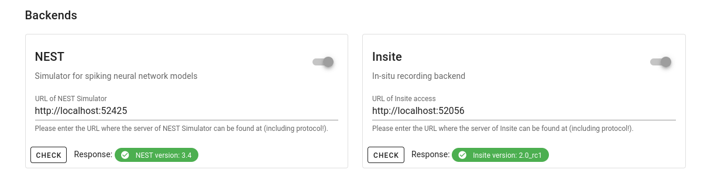
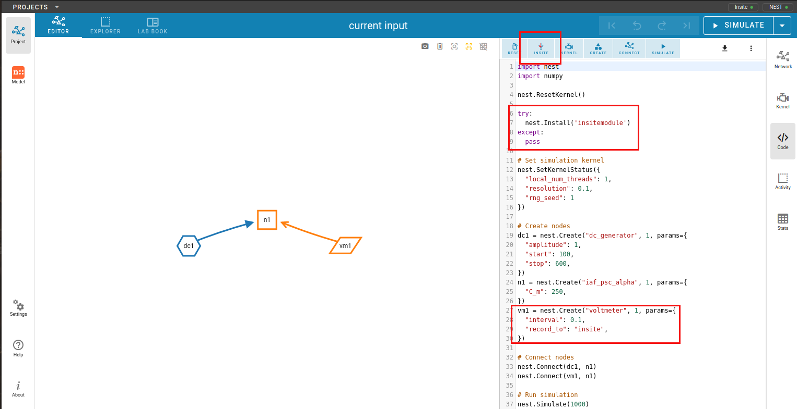
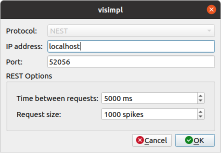
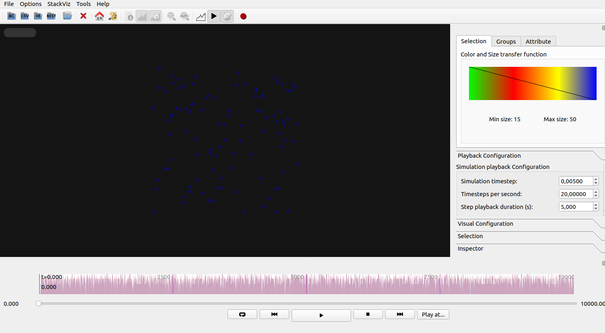
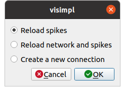

====================
Connecting With NEST
====================

ViSimpl can visualize the simulations made with `'NEST desktop'`_ connecting via the `Insite pipeline`_. ViSimpl needs the positions so the simulations must contain spatial information.

----
NEST
----

For ViSimpl to visualize a NEST desktop simulation it must be run with Insite as a recording backend, so Insite must be activated in the 'Settings' page (:numref:`fig1N`).

.. _fig1N:

   NEST backends configuration.

.. note::
  By default the REST connection ViSimpl uses to connect to Insite uses the port 52056 and the IP of the local machine, if the configuration is different the user will need to use the port configured in Nest desktop and the corresponding IP address.

When both buttons in the upper right corner of NEST desktop are in the green (indicating that both Insite and NEST backends are enabled) the user must enable the 'Insite' button in the simulation code tab. The user can check for Insite being used as a recorder if the following snippets are included (:numref:`fig2N`) in the code listing::

        try:
          nest.Install('insitemodule')
        except:
          pass

And::

        sr1 = nest.Create("spike_recorder", 1, params={
          "record_to": "insite",
        })

.. _fig2N:

   NEST simulation code tab.

Then the simulation can be run and will be available from the Insite end. ViSimpl can connect to it using the 'Open REST connection' button that will show a connection configuration dialog (:numref:`fig3N`) allowing the user to set the connection parameters (IP and port), the number of spikes in each call and the waiting times for the connection. The default values should be appropiate for a normal simulation.

.. _fig3N:

   ViSimpl REST connection configuration.

Once the network and some spikes have been loaded ViSimpl will show it and in the background will be requesting data to Insite, so for simulations with a big number of spikes the histogram widget and the simulation times will be updated regularly with new data received from Insite. There is no need to load the complete simulation to start visualizing it. 

.. _fig4N:

   ViSimpl with NEST simulation loaded.

If the simulation changes the user can restart the ViSimpl visualization with the new data by clicking on the 'Open REST connection' again. This time a dialog requesting what data needs to be loaded will be shown, allowing the user to reload only the spikes, reload the whole simulation, cancel or start a new REST connection (:numref:`fig5N`).

.. _fig5N:

   REST connection update dialog.

.. _'NEST desktop': https://www.nest-simulator.org/
.. _Insite pipeline: https://nest-desktop.readthedocs.io/en/latest/user/usage-external/usage-with-visimpl.html
